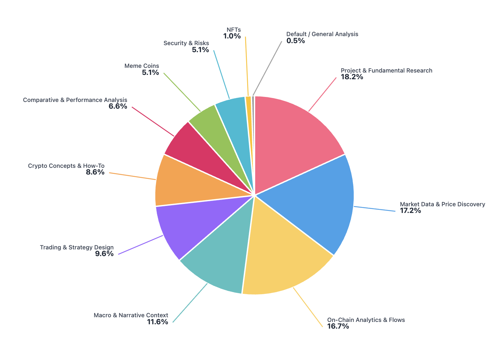

# CryptoAnalystBench

<p align="center">
  <a href="data/dataset.csv">Dataset</a> | <a href="https://blog.sentient.xyz/">Blog</a>
</p>

A comprehensive LLM evaluation system for Web3/crypto domain queries. This system evaluates multiple LLM model responses using Deepseek as a judge, scoring responses on four key parameters: Temporal Relevance, Data Consistency, Depth, and Relevance.

## Evaluation Summary

CryptoAnalystBench evaluates LLM responses to crypto/blockchain queries using an automated judge (Deepseek) that scores each response on:

- **Temporal Relevance (1-10)**: How current and timely is the information?
- **Data Consistency (1-10)**: How consistent and contradiction-free is the information?
- **Depth (1-10)**: How comprehensive and detailed is the response?
- **Relevance (1-10)**: How well does the response address the specific question?

The system generates comprehensive evaluation reports including per-model statistics, tag-wise rankings, and comparative analysis.

## Category distribution of CryptoAnalystBench queries

The benchmark dataset contains **198 queries** across **11 unique tags**:



| Tag | Count |
|-----|-------|
| Project & Fundamental Research | 36 |
| Market Data & Price Discovery | 34 |
| On-Chain Analytics & Flows | 33 |
| Macro & Narrative Context | 23 |
| Trading & Strategy Design | 19 |
| Crypto Concepts & How-To | 17 |
| Comparative & Performance Analysis | 13 |
| Meme Coins | 10 |
| Security & Risks | 10 |
| NFTs | 2 |
| Default / General Analysis | 1 |

## How to Run

1. **Set up virtual environment**:
```bash
python3.12 -m venv venv
source venv/bin/activate  # On Windows: venv\Scripts\activate
pip install -r requirements.txt
```

2. **Configure environment variables**:
```bash
cp .env-example .env
```
Edit `.env` and add your API key:
```
export FIREWORKS_API_KEY="your_api_key_here"
```

3. **Prepare your input file**:
   - Use `dataset.csv` for queries
   - Generate one input file with LLM responses for each query
   - Place the input file under `data/input/`

4. **Run the evaluation**:
```bash
python3.12 script.py --csv_path data/input/your_input_file.csv --models model1 model2 model3
```

**Example**:
```bash
python3.12 script.py --csv_path data/input/sample_input.csv --models sentient gpt5 grok4 pplx
```

**Optional arguments**:
- `--num_workers`: Number of parallel workers (default: 3)
- `--max_queries`: Maximum number of queries to evaluate (default: all)

5. **Output**: The evaluation generates an XLSX file in `data/output/` with:
   - Evaluation Results (detailed scores and rankings)
   - Per-Model Statistics (aggregate metrics)
   - Tag-wise Rankings (performance by query category)

## Expected Input File Format

The input CSV file must contain:

- **Required columns**:
  - `query`: The crypto/blockchain question to evaluate
  - `{model_name}_response`: Response column for each model (e.g., `sentient_response`, `gpt5_response`, `grok4_response`)

- **Optional columns**:
  - `tags`: Category tags for the query (e.g., "Macro & Narrative Context", "Comparative & Performance Analysis")

**Example structure**:

| query | tags | sentient_response | gpt5_response | grok4_response | pplx_response |
|-------|------|-------------------|---------------|----------------|---------------|
| What's the Bitcoin fear and greed index today? | Macro & Narrative Context | Response from Sentient... | Response from GPT5... | Response from Grok4... | Response from PPLX... |

**Note**: Use `dataset.csv` for queries → generate one input file with LLM responses → place them under `data/input` and now good to go!!!